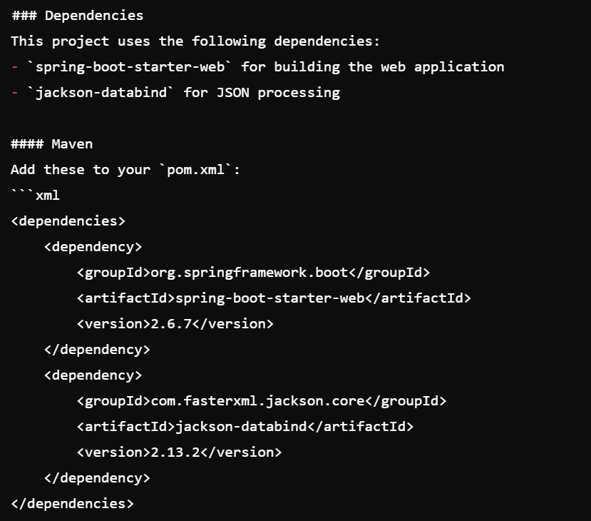
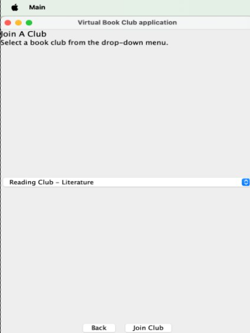
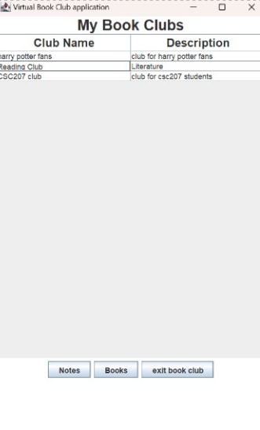
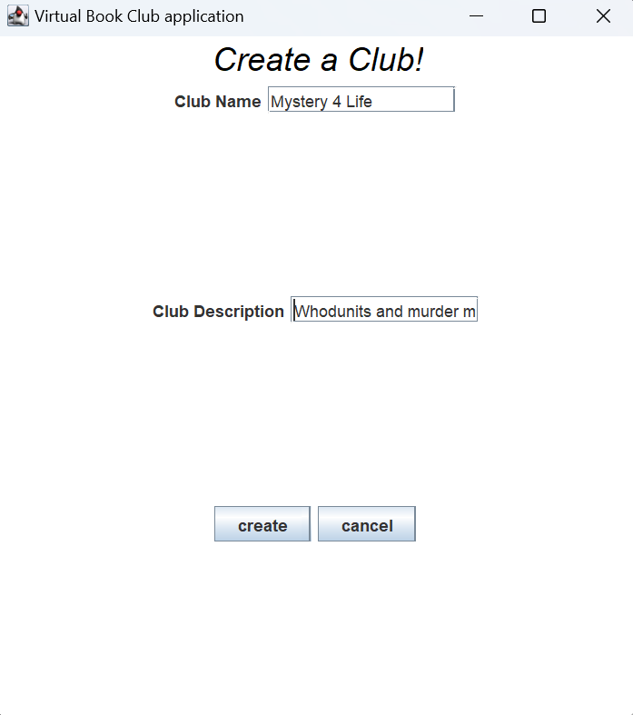
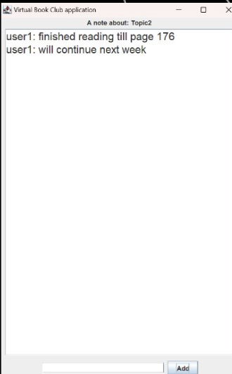
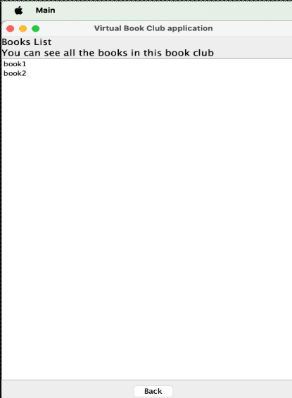
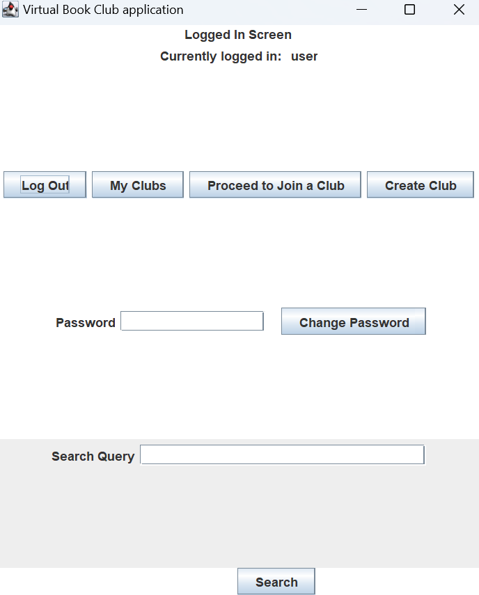

# Page Turners: A Virtual Book-Club

## Table of Contents

1. [Introduction to Page Turners](#page-turners-a-general-introduction)
2. [Contributors](#contributors)
3. [Installation Instructions](#installation-instructions)
4. [Features of the Software](#features-of-the-software)
5. [Simple User Guide](#usage-guide)
6. [Feedback](#feedback)
7. [If You'd Like to Contribute](#contributions)
8. [License](#license)

* * *
## Page Turners: A General Introduction:
Page Turners is a virtual book-club that lets you join book-clubs that you are interested in or create book-clubs if you
don't find something suitable to your liking. Additionally, you can maintain personal notes about the current books that
you are reading and access the list of books in a book-club. The search function lets you search for your next big read.
Our project has the primary goal of enhancing a book lover's dream.

* * *
## Contributors

| Name                 | GitHub Username                                  |
|----------------------|--------------------------------------------------|
| Meldy Bile           | [@meldy04](https://github.com/meldy04)           |
| Jason Han            | [@jason101111](https://github.com/jason101111)   |
| Vishaka Rajani       | [@vishraj12](https://github.com/vishraj12)       |
| Ali Shaikh           | [@alihassan200](https://github.com/alihassan200) |
| Yodishtr Vythilingum | [@Yodishtr](https://github.com/Yodishtr)         |
| Ali Zeitoun          | [@zeitoun1](https://github.com/zeitoun1)         |

* * *

## Installation Instructions
1. Make a fork of the Github repo and clone it.
2. Ensure that the pom file has been downloaded.
3. Reload the project after adding dependencies.
4. Ensure that JDK 17 or above is installed on Intellij.
5. The software makes use of OpenLibraryClient API to call out API link points.
5. The program runs on all systems and the Jackson 2.16.2 and Gson 2.11.0 packages should be downloaded to run this software.

* * *

## Features of the Software
1. You can join a book-club by browsing the list of current book clubs and it will show up in your clubs.
   
   
2. You can create a book-club about any topic and it'll automatically show up in your clubs once joined.
   
3. From the My Clubs tab, you can access each individual book club's books and your own personal notes.
   
   
4. If you decide to not be a part of a bookclub anymore, you can click exit bookclub in the bottom panel and it'll 
disappear from your clubs and you won't be a member anymore. 
5. With our search, you can look for books that cater to your interests, or you can search for a specific title.
   

* * *

## Usage Guide
1. Run main which will prompt you to sign up. After signing up, you can get to the home-screen.
   
2. From your home-screen, you can access all the functions listed in [the major features](#features-of-the-software) 
including creating a book-club, joining a book-club, searching for books, accessing personal notes and book-lists.
3. Once you're done with the program, please click logout. Your bookclubs will be saved for the next time you want to 
access them.
* * *
# Feedback
If you'd like to provide feedback on our program, please reach out to us at alihassan.shaikh@mail.utoronto.ca. Please 
include Page Turners in the subject line and we will try our best to get back to you in a week. 
* * *
# Contributions
If you'd like to contribute, please fork our repository from Github and make a clone using the HTTPS link. Create a branch 
and add in your own code. If you are contributing to our software for the first time, please email us with the changes you
would like to make and a detailed plain for them at the email listed in [feedback](#feedback). However, you are not 
allowed to make changes to the base program.

* * *
# License
To view our license, please click the following [link](LICENSE).

